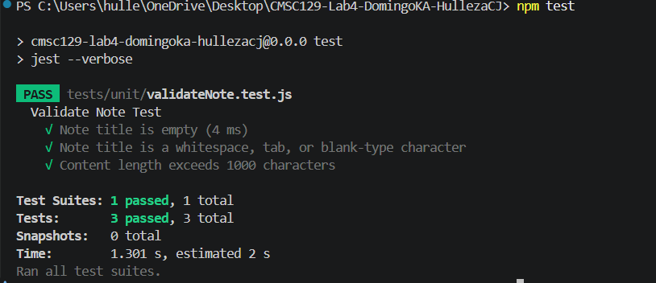

## App Description
This application is a lightweight, browser-based notepad application that allows users to create, view, and delete text notes. 

## User Stories
1. **Create a Note:** As a user, I want to type a title and content into a form and save so that I can store my thoughts for later.
2. **Read and Update Notes:** As a user, I want to see a list of all my saved notes on the main screen so that I can easily find what I've written. Also, pressing on a button allows me to edit the contents of my file, and save with confiramtion so that I can safely update a note without the need to create a new file.  
3. **Delete a Note:** As a user, I want to click a delete button on a specific note with confirmationso that I can remove it safely from my list.

## Tech Stack and Testing Tools
* **Frontend:** React.js
* **Storage:** Window LocalStorage API
* **Unit Testing:** Jest,
* **System (E2E) Testing:** Cypress

## Testing Strategy

### 1. Unit Testing
The unit test will focus on note object validation feature. The function will return `true` if the form passes a series of tests; otherwise, it will return `false`. 

* **Test 1: Empty Title Prevention**
    * **Goal:** Ensure notes cannot be saved without a title. 
    * **Input** `Note object with a blank title`
    * **Expected Output:**  `false`
* **Test 2: Whitespace-esque Title Prevention**
    * **Goal:** Ensure trailing whitespaces, tabs, and other forms of blank spaces will not be accepted as a title.
    * **Input:** `Note title and content will contain a type of white space`
    * **Expected Output:** `false`
* **Test 3: Content Length Validation**
    * **Goal:** Ensure note content doesn't exceed 1000 characters.
    * **Input** `Note object with a content exceeding 1000 characters`
    * **Expected Output:**  `false`

### 2. Integration Testing (Minimum 2 Tests)
Integration testing will tackle all the CRUD operation and their respective API endpoints. This will be broken down per section by CRUD operation features.

#### I. Add Note Object Request-Response Cycle

* **Test 1: Correct Request Body**
    * **Goal:** To verify that the system successfully saves a valid note and confirms it with the correct HTTP status.
    * **Flow:**
        1.  The client initiates the cycle by sending a `POST` request to the `/notes` endpoint.
        2.  The request body contains a valid JSON object with both a `title` and `content`.
        3.  The server receives the request, passes it through validation, and successfully communicates with the database to store the record.
    * **Expected Input:** `POST /notes`, `{ "title": "Lab Study", "content": "Review TDD" }`
    * **Expected Output:** `201 Created`, `{ "id": 1, "title": "Lab Study", "content": "Review TDD" }`

* **Test 2: Missing Required Fields**
    * **Goal:** To verify that the system refuses to save incomplete data and provides correct error feedback.
    * **Flow:**
        1.  The client sends a `POST` request to `/notes`.
        2.  The request body is missing the required `title` field.
        3.  The server identifies the missing field during validation and halts the database insertion.
    * **Expected Input:** `POST /notes`, `{ "content": "Missing title" }`
    * **Expected Output:** `400 Bad Request`, `{ "error": "Title is required" }`

#### II. Edit Note Object Request-Response Cycle**

* **Test 1: Valid Update**
    * **Goal:** To verify that an existing note can be successfully modified using its unique ID.
    * **Flow:**
        1.  The client sends a `PUT` request to `/notes/1` with updated text.
        2.  The server locates the note by ID and updates the record in the database.
    * **Expected Input:** `PUT /notes/1`, `{"title": "Lab Study", "content": "Updated content" }`
    * **Expected Output:** `200 OK`, `{ "id": 1, "title": "Lab Study", "content": "Updated content" }`

* **Test 2: Non-existent ID**
    * **Goal:** To ensure the system handles requests for notes that do not exist in the database.
    * **Flow:**
        1.  The client sends a `PUT` request to an ID that hasn't been created (e.g., `/notes/999`).
        2.  The server searches the database, finds no match, and terminates the update process.
    * **Expected Input:** `PUT /notes/999`, `{ "title": "Ghost Note", "content": "Wah" }`
    * **Expected Output:** `404 Not Found`, `{ "error": "Note ID not found" }`

#### III. Read All Note Objects Request-Response Cycle
* **Test 1: Retrieve Full List**
    * **Goal:** To verify the system can successfully fetch every stored note and return them as a list.
    * **Flow:**
        1.  The client sends a `GET` request to the `/notes` endpoint.
        2.  The server queries the database for all records.
        3.  The server formats the results into an array.
    * **Expected Input:** `GET /notes`
    * **Expected Output:** `200 OK`, `[{ "id": 1, "title": "Lab", ... }, { "id": 2, ... }]`

* **Test 2: Data Source Error (Server Error)**
    * **Goal:** To ensure the system provides a proper error response if the database is unreachable.
    * **Flow:**
        1.  The client sends a `GET` request to the `/notes` endpoint.
        2.  The server attempts to connect to the database but encounters a connection failure.
        3.  The server catches the exception and notifies the client of the internal issue.
    * **Expected Input:** `GET /notes`
    * **Expected Output:** `500 Internal Server Error`, `{ "error": "Unable to retrieve notes at this time" }`

#### IV. Retrieve a Specific Note Request-Response Cycle

* **Test 1: Fetch by ID**
    * **Goal:** To verify that the system can retrieve the details of one specific note using its ID.
    * **Flow:**
        1.  The client sends a `GET` request to `/notes/1`.
        2.  The server searches for the specific record matching that ID.
    * **Expected Input:** `GET /notes/1`
    * **Expected Output:** `200 OK`, `{ "id": 1, "title": "Lab Study", "content": "Review TDD" }`

* **Test 2: Malformed ID (Negative)**
    * **Goal:** To verify the system handles invalid ID formats (e.g., text instead of numbers) without crashing.
    * **Flow:**
        1.  The client sends a `GET` request to `/notes/not-an-id`.
        2.  The server validates the ID format and determines it is invalid before checking the database.
    * **Expected Input:** `GET /notes/not-an-id`
    * **Expected Output:** `400 Bad Request`, `{ "error": "Invalid ID format" }`

#### V. Delete Note Object Request-Response Cycle
* **Test 1: Valid Deletion (Positive)**
    * **Goal:** To verify that a note is successfully removed from the system.
    * **Flow:**
        1.  The client sends a `DELETE` request to `/notes/1`.
        2.  The server removes the record from the database.
    * **Expected Input:** `DELETE /notes/1`
    * **Expected Output:** `204 No Content`

* **Test 2: Resource Not Found** 
    * **Goal:** To ensure the system correctly informs the user if they try to delete something that doesn't exist.
    * **Flow:**
        1.  The client sends a `DELETE` request for an ID that isn't in the system (e.g., `/notes/555`).
        2.  The server checks the database, finds no matching record, and stops the process.
    * **Expected Input:** `DELETE /notes/555`
    * **Expected Output:** `404 Not Found`, `{ "error": "Note does not exist" }`

### 3. System Testing  
The following tests are based on the user stories above:

#### User Story 1: Create a Note
* **User Story:** *As a user, I want to type a title and content into a form and save so that I can store my thoughts for later.*

* **Test Scenario:** Successfully adding a new note to the collection.
* **Flow of Operation:**
    1.  **Navigate:** User opens the application in the browser. User then presses a button that leads to a form for adding notes.
    2.  **Interaction:** User enters "Lab 4 Tasks" in the Title field and "Complete system tests" in the Content field.
    3.  **Action:** User clicks the **"Save"** button.
* **System Assertion:** The form is cleared, and the new note "Lab 4 Tasks" appears visually at the top of the notes list with a toast at the bottom showing a successful adding of the new task

#### User Story 2: Read and Update Notes
* **User Story:** *As a user, I want to see a list of all my saved notes... edit the contents... and save with confirmation so that I can safely update a note.*

* **Test Scenario:** Modifying an existing note's content with a confirmation safeguard.
* **Flow of Operation:**
    1.  **Navigate:** User views the list of notes on the dashboard.
    2.  **Interaction:** User clicks the **"Edit"** button on the "Lab 4 Tasks" note.
    3.  **Action:** User changes the content and clicks **"Update"**.
    4.  **Confirmation:** The system displays a browser confirmation dialog ("Are you sure?"); the user clicks **"OK"**.
* **System Assertion:** The dashboard reflects the updated text immediately, and no duplicate note is created with a toast at the bottom showing a successful updating of the new task

#### User Story 3: Delete a Note
* **User Story:** *As a user, I want to click a delete button on a specific note so that I can remove it with confirmation from me.*

* **Test Scenario:** Removing an unwanted note from the system permanently.
* **Flow of Operation:**
    1.  **Navigate:** User identifies a note to remove.
    2.  **Action:** User clicks the **"Delete"** icon associated with that note.
    3.  **Confirmation:** The system prompts the user with "Are you sure you want to delete this note?"; the user clicks **"Yes"**.
* **System Assertion:** The note is removed from the UI list with a toast at the bottom showing a successful updating of the new task.

## Setup Instructions
1.  **Clone the repository:** `git clone <repository-url>`
2.  **Install dependencies:** `npm install`
3.  **Launch development server:** `npm start`
4.  **Execute test suites:**
    * `npm test`

## Test Results
### Unit Tests
* **Unit Tesing for Note Object Validataion**

    